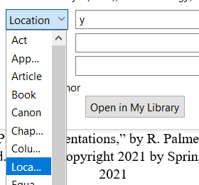
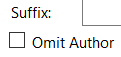

# ZoterZero for APA citation

A VBA macro that modifies Zotero's APA citation into multiple variants (notably the author-only cites).

[Original thread on Zotero forum
](https://forums.zotero.org/discussion/73159/announcing-zoterzero-for-author-only-cites)

# Usage

- This VBA macro works only on **single APA citation(s)**

1. When you add/edit citations using the Zotero window, click on the citation and choose the `location` property
    
    

2. Enter the following string into the `location` field according to the desired modification

    |pattern|modification|
    |---|---|
    |`a`|author|
    |`a (y)`|author (YYYY)|
    |`a y`|author YYYY|
    |`y`|YYYY|

    **Reminder** - **DO NOT** check the `Omit author` option

    

3. Refresh the document's Zotero references if needed. Every Zotero refresh will revert the modifications done by the VBA macro (next step)
4. Use the "Process Zotero Citations" macro shortcut to apply the citation modifications

# Installation
## Option 1: Download the `zoterzero.dotm` file from Releases
- Download the `zoterzero.dotm` file from the [latest release](https://github.com/loneguardian/zotero-zoterzero/releases). It contains all the VBA modules and macro shortcut compiled into one file
- Place the `zoterzero.dotm` file in the `%AppData%\Roaming\Microsoft\Word\STARTUP` for the VBA modules to be loaded automatically

## Option 2: Manually create your own `zoterzero.dotm` file
- Create a new Word document
- Enter VBA editor through Developer tab or shortcut (Default: `Alt + F11`)
- Import the following modules
    - VBA-JSON library from https://github.com/VBA-tools/VBA-JSON
    - VBA-Dictionary module as mentioned in the [installation instruction for VBA-JSON](https://github.com/VBA-tools/VBA-JSON#installation)
    - ZoterZero module from this repo
- Compile the VBA code using `Debug` > `Compile Project`, refer to the instructions from the VBA-JSON repo to resolve any missing reference(s)
- Create a shortcut to run the `ZoterZero()` macro/function
- Save the Word document as a `Word Macro-Enabled Template (*.dotm)` file. Name the document `zoterzero.dotm`
- Place the `zoterzero.dotm` file in `%AppData%\Roaming\Microsoft\Word\STARTUP` for it to be loaded automatically for all documents
